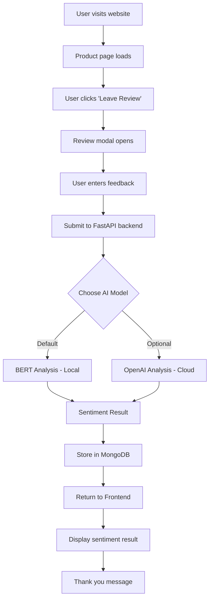

# MKP Development Repository

Welcome to the MKP Development Repository - a collection of innovative software projects and experiments.

---

## 🎯 Featured Project: AI Sentiment Analyzer

A full-stack web application that provides real-time sentiment analysis for customer feedback using advanced AI models. Built with modern technologies for scalability and performance.

### 🚀 Key Features
- **Real-time Sentiment Analysis** - Instant feedback classification
- **Dual AI Models** - BERT (default) and OpenAI GPT integration
- **Modern Web Stack** - React frontend with FastAPI backend
- **Data Persistence** - MongoDB for feedback storage and analytics
- **Production Ready** - Docker support and deployment configurations

### 🏗️ Architecture Overview

```
┌─────────────────┐    HTTP/REST    ┌──────────────────┐    AI Models    ┌─────────────────┐
│                 │    Requests     │                  │                 │                 │
│  React Frontend │◄───────────────►│  FastAPI Backend │◄───────────────►│ BERT / OpenAI   │
│                 │                 │                  │                 │                 │
│  • Product UI   │                 │  • API Endpoints │                 │ • Local BERT    │
│  • Review Modal │                 │  • Data Validation│                 │ • Cloud OpenAI  │
│  • Results View │                 │  • Business Logic│                 │ • Sentiment Cls │
└─────────────────┘                 └──────────────────┘                 └─────────────────┘
         │                                     │
         │                                     │
         │                                     ▼
         │                          ┌──────────────────┐
         │                          │                  │
         └─────────────────────────►│  MongoDB Atlas   │
                                    │                  │
                                    │ • Feedback Store │
                                    │ • Analytics Data │
                                    │ • User Sessions  │
                                    └──────────────────┘
```

### 🔄 Application Flow



### 📊 Sentiment Analysis Methods

| Method | Type | Speed | Cost | Accuracy | Use Case |
|--------|------|-------|------|----------|----------|
| **BERT** | Local | Fast | Free | High | Production default |
| **OpenAI** | Cloud API | Medium | Paid | Very High | Premium analysis |

### 🛠️ Technology Stack

#### Frontend
- **React 18** - Modern UI framework
- **Vite** - Fast build tool and dev server
- **CSS3** - Responsive styling and animations

#### Backend
- **FastAPI** - High-performance Python web framework
- **Pydantic** - Data validation and serialization
- **Uvicorn** - ASGI server for production

#### AI/ML
- **Hugging Face Transformers** - BERT model integration
- **OpenAI API** - GPT-based sentiment analysis
- **PyTorch** - Deep learning framework

#### Database
- **MongoDB** - Document database for feedback storage
- **PyMongo** - Python MongoDB driver

### 📁 Project Structure

```
AIsentimentanalyzer/
├── backend/                 # FastAPI backend service
│   ├── main.py             # API endpoints and business logic
│   ├── bert_sentiment.py   # BERT model integration
│   ├── requirements.txt    # Python dependencies
│   └── README.md          # Backend documentation
├── frontend/               # React frontend application
│   ├── src/
│   │   ├── App.jsx        # Main React component
│   │   ├── App.css        # Styling and layout
│   │   └── assets/        # Images and static files
│   ├── package.json       # Node.js dependencies
│   └── README.md         # Frontend documentation
└── README.md             # Project overview
```

### 🚀 Quick Start

1. **Clone the repository**
   ```bash
   git clone https://github.com/murugesankp/mkpdev.git
   cd mkpdev/AIsentimentanalyzer
   ```

2. **Backend Setup**
   ```bash
   cd backend
   pip install -r requirements.txt
   uvicorn main:app --reload
   ```

3. **Frontend Setup**
   ```bash
   cd frontend
   npm install
   npm run dev
   ```

4. **Access the application**
   - Frontend: http://localhost:5173
   - Backend API: http://localhost:8000
   - API Documentation: http://localhost:8000/docs

### 📈 Future Enhancements

- [ ] User authentication and profiles
- [ ] Advanced analytics dashboard
- [ ] Multi-language sentiment support
- [ ] Real-time notifications
- [ ] A/B testing for AI models
- [ ] API rate limiting and caching

### 🤝 Contributing

Contributions are welcome! Please feel free to submit pull requests or open issues for bugs and feature requests.

### 📄 License

This project is part of the MKP Development portfolio and is available for educational and development purposes.

---

## 📚 Additional Projects

More projects and experiments will be added to this repository as development continues.

**Repository Owner:** [Murugesan KP](https://github.com/murugesankp)
